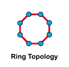
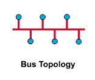
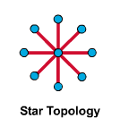

# 1-1 컴퓨터 네트워크와 인터넷

### 네트워크와 인터넷

1. 네트워크
- 종단 시스템(end system) : PC나 스마트폰처럼 네트워크 송수신 주체
- 프로토콜(Protocol) : 두 이종 시스템을 연결하기 위한 규약
- 통신을 목적으로 실제 물리적으로 선으로 연결되어 있거나 무선으로 연결됨

2. 인터넷
- 회사 혹은 소규모의 네트워크에서 전세계 네트워크와 연결된 상태
- 다양한 애플리케이션 서비스가 제공되고 있다
- 종단 시스템은 보통 ISP(Internet Service Provider)에 의해 연결 Ex) KT, LG

3. OSI 7계층 (Layer)
- 네트워크 구성요소를 7개의 계층으로 역할을 나눈 표준 모델
- 각 게층별 역할을 통해 통신 규격(프로토콜)을 만족
- 일부 하위계층은 하드웨어에서 구현되며 상위계층은 소프트웨어로 구현

4. TCP/IP(Transmission Control Protocal/Internet Protocol)
- OSI 7계층이 나오기전 널리 사용되던 사실상 표준 역할
- 각 계층별 역할에 따라 역할이 나누어짐

### 그 밖에 자주 사용되는 용어들

1. IP 주소 (Address)
- 통신 자료를 최종적으로 전달하기 위해 필요한 송/수신 위치정보
- 보통 IPv4의 주소를 사용하며 주소 부족을 위해 IPv6가 개발됨

2. 패킷 교환 (Packet Switching)
- 종단간에 전송되는 데이터를 패킷(Packet)이라는 단위로 전달함
- 패킷은 네트워크를 통해 일정한 순서없이 보내지며 어떤 경로를 통해 이동되는지는 네트워크의 상황에 따라 다르다

### 통신을 위한 기본 동작

1. 요청 (Request)
2. 인지 (Indicate)
3. 응답 (Response)
4. 확인 (Confirm)

### 네트워크의 유형

1. LAN (Local Area Network)
- 일정 그룹의 지역 네트워크 (집, 사무실, 학교 등)
- 소규모로 묶이며 사설망등을 구축해 연결
2. WAN (Wide Area Network)
- 원거리 통신망으로 넓은 범위 연결 (국가, 대륙)
3. 크기 유형
- LAN < WAN < Internet

### 네트워크 토폴로지

1. Ring Topology

2. Bus Topology

3. Star Topology

4. Mesh Topology

이외에도 Extended Star , Hierarchical 등이 있다