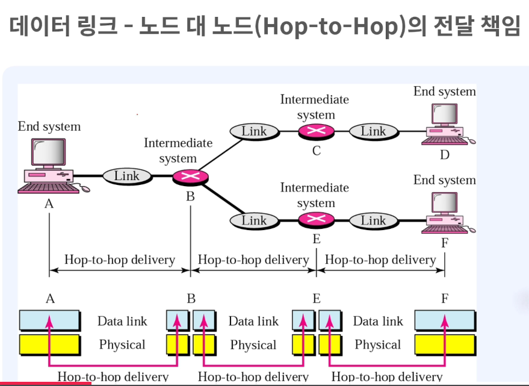

# 1-3 데이터 링크 계층, 네트워크 계층의 역할

### 데이터 링크 계층 (Data Link Layer)

1. 데이터 링크 계층이란?
- 직접 연결된 두 기기(노드) 사이에서 데이터를 안전하게 전달하는 역할
- 물리 계층에서 받은 비트 신호를 의미있는 "프레임" 단위로 만들어 처리

2. 주요 기능
- **프레임 구성**: 데이터를 프레임이라는 단위로 묶어서 관리
- **물리 주소 지정**: MAC 주소를 사용해 바로 옆 기기가 누구인지 식별
- **흐름 제어**: 받는 쪽이 처리할 수 있는 속도에 맞춰 데이터 전송 속도 조절
- **오류 제어**: 전송 중 데이터가 손상되거나 손실되면 감지하고 재전송
- **접근 제어**: 여러 기기가 동시에 데이터를 보내려 할 때 순서 조율

3. 프레임의 구조
- 네트워크 계층에서 받은 데이터에 헤더(H2)와 트레일러(T2)를 추가
- 헤더: 목적지와 출발지의 MAC 주소 정보
- 트레일러: 오류 검출을 위한 정보

### 데이터 링크 계층의 프로토콜

1. ARP (Address Resolution Protocol)
- IP 주소만 알고 있을 때, 상대방의 MAC 주소를 알아내는 프로토콜
- 예: "192.168.0.10의 MAC 주소가 뭐야?"라고 네트워크에 물어봄
- 한 번 알아낸 정보는 캐시에 저장해두고 약 20분간 재사용

2. RARP (Reverse ARP)
- ARP와 반대로, MAC 주소로 IP 주소를 알아내는 프로토콜
- 하드디스크가 없는 단말기가 부팅할 때 자신의 IP 주소를 얻기 위해 사용

### Hop-to-Hop 전달 방식

1. Hop-to-Hop이란?
- "Hop"은 네트워크에서 한 단계를 의미 (A → B로 가는 한 구간)
- 데이터 링크 계층은 바로 옆 기기까지만 책임짐 (한 홉씩 전달)

2. 전달 과정
- 출발지 → 중간 라우터1 → 중간 라우터2 → 목적지
- 각 구간마다 데이터 링크 계층과 물리 계층이 동작
- 각 홉에서 MAC 주소를 보고 다음 기기로 전달

### 물리 주소(MAC Address)를 이용한 전달

1. 물리 주소란?
- 네트워크 장비에 부여된 고유 하드웨어 주소 (예: 07:01:02:01:2C:4B)
- 전 세계에서 유일한 주소로, 네트워크 카드 제조 시 부여됨

2. 전달 과정 예시
- 컴퓨터 10번이 컴퓨터 87번에게 데이터를 보낼 때
- 프레임의 헤더에 "출발: 10번, 도착: 87번" 정보를 담음
- 각 홉마다 MAC 주소를 확인하여 데이터를 전달
- 중간 기기들은 자신의 MAC 주소가 아니면 다음 기기로 전달

### 네트워크 계층 (Network Layer)

1. 네트워크 계층이란?
- 서로 다른 네트워크에 있는 기기끼리 통신할 수 있게 해주는 계층
- 출발지부터 최종 목적지까지 데이터가 도달할 수 있도록 경로를 찾아줌

2. 주요 기능
- **논리 주소 지정**: IP 주소를 사용해 전 세계 어디든 찾아갈 수 있게 함
- **라우팅**: 여러 경로 중 최적의 길을 선택 (마치 내비게이션처럼)
- **패킷 전달**: 데이터를 "패킷" 단위로 나누어 독립적으로 전송

3. 패킷의 구조
- 전송 계층에서 받은 데이터에 헤더(H3)를 추가
- 헤더: 출발지 IP 주소와 목적지 IP 주소 정보

### 네트워크 계층의 전달 과정

1. 라우팅의 필요성
- 같은 네트워크 안에서는 MAC 주소만으로도 통신 가능
- 하지만 다른 네트워크에 있는 기기와 통신하려면 IP 주소 필요

2. 전달 과정
- IP 주소 A를 가진 컴퓨터가 IP 주소 P를 가진 컴퓨터에게 데이터 전송
- 여러 라우터를 거쳐가지만, IP 주소는 바뀌지 않음 (MAC 주소는 각 홉마다 변경)
- 라우터가 목적지 IP를 보고 어느 방향으로 보낼지 결정

### 네트워크 계층의 프로토콜

1. IP (Internet Protocol)
- 인터넷에서 사용하는 주소 체계
- **IPv4**: 약 43억 개의 주소 제공 (예: 192.168.0.1)
- **IPv6**: IPv4 주소 부족 문제 해결을 위해 개발, 거의 무한대의 주소 제공

2. ICMP (Internet Control Message Protocol)
- 네트워크 상태를 확인하거나 오류를 알려주는 프로토콜
- ping 명령어가 ICMP를 사용 (상대방이 살아있는지 확인)

3. IGMP (Internet Group Management Protocol)
- 한 번에 여러 기기에 데이터를 전송할 때 사용 (멀티캐스트)
- 예: 인터넷 방송, 화상 회의 등

### End-to-End 전달 방식

1. End-to-End란?
- 출발지부터 최종 목적지까지 전체 경로를 책임지는 방식
- 네트워크 계층은 중간에 얼마나 많은 라우터를 거치든 최종 도착을 보장

2. Hop-to-Hop vs End-to-End
- **Hop-to-Hop**: 데이터 링크 계층, 바로 옆 기기까지만 책임
- **End-to-End**: 네트워크 계층, 출발지부터 목적지까지 전체 경로 책임

### 데이터 링크 계층 vs 네트워크 계층

| 항목 | 데이터 링크 계층 | 네트워크 계층 |
|------|------------------|---------------|
| 전달 범위 | 이웃한 기기까지 (Hop-to-Hop) | 출발지부터 목적지까지 (End-to-End) |
| 사용 주소 | 물리 주소 (MAC Address) | 논리 주소 (IP Address) |
| 데이터 단위 | Frame (프레임) | Packet (패킷) |
| 비유 | 택배 상하차 기사 (구간마다) | 택배 경로 설계자 (전체 경로) |
| 주요 역할 | 직접 연결된 기기 간 안전한 전송 | 전체 네트워크에서 경로 찾기 |
| 프로토콜 예시 | ARP, RARP | IP, ICMP, IGMP |

### 쉬운 이해를 위한 비유

**택배 배송으로 비유하면:**

- **물리 계층**: 실제 도로와 차량 (비트를 전기 신호로 전송)
- **데이터 링크 계층**: 각 구간의 배송 기사 (서울→대전, 대전→부산 각각 담당)
  - MAC 주소: 각 구간 담당자 이름표
  - 프레임: 포장된 택배 박스
- **네트워크 계층**: 전체 배송 경로 설계자 (서울→부산 전체 경로 책임)
  - IP 주소: 최종 배송 주소
  - 패킷: 주소가 적힌 택배 송장

### 핵심 정리

1. **데이터 링크 계층**
- 직접 연결된 두 기기 사이에서 안전하게 데이터 전달
- MAC 주소를 사용하며, 각 구간(홉)마다 동작
- 프레임 단위로 데이터 처리

2. **네트워크 계층**
- 서로 다른 네트워크의 기기끼리 통신 가능하게 함
- IP 주소를 사용하며, 출발지부터 목적지까지 전체 경로 담당
- 패킷 단위로 데이터 처리, 라우팅으로 최적 경로 선택

3. **협력 관계**
- 네트워크 계층이 전체 경로를 계획하면
- 데이터 링크 계층이 각 구간을 실제로 전달
- 두 계층이 함께 동작해야 데이터가 목적지까지 도착
